# W7 Evidence Pack: BudgetBot — AI Money Coach (Group 9)

## 1. Cover
- **Group ID:** G9
- **Member Names:** [Điền tên thành viên]
- **Live URL:** [Điền URL CloudFront — dạng https://xxxxxxx.cloudfront.net]
- **GitHub Repo:** [Điền link Github]

## 2. Domain & Use Case
- **Domain:** FinTech — AI Money Coach
- **Use Case:** Người dùng upload file sao kê ngân hàng (CSV) → AI tự động phân loại từng giao dịch vào danh mục chi tiêu → Hệ thống lưu kết quả vào Database và hiển thị báo cáo chi tiêu trực quan theo tháng.
- **Target Users:** Cá nhân muốn quản lý tài chính mà không cần tự nhập liệu thủ công. Doanh nghiệp nhỏ cần phân loại chi phí định kỳ.
- **Market Reasoning:** Quản lý chi tiêu là nhu cầu thiết yếu nhưng người dùng thường bỏ cuộc do phải nhập liệu thủ công. Kết hợp file CSV có sẵn từ ngân hàng với AI phân loại tự động giúp giải quyết điểm nghẽn này và tạo giá trị tức thì.
- **Named Real-world Parallel:** Cleo AI, Cake AI (by VPBank).

## 3. Architecture & Service Decisions

### Architecture Overview
- **Frontend:** Next.js App Router + Tailwind CSS + shadcn/ui → Build tĩnh lưu trên **S3 Bucket**, phân phối qua **CloudFront** (HTTPS).
- **Compute:** **API Gateway (HTTP API)** định tuyến request vào 2 **AWS Lambda functions** (Upload + Chat), chạy Python 3.11 trong Private Subnets.
- **AI Feature:** Upload Lambda gọi **Amazon Bedrock (Nova Lite)** để phân loại giao dịch. Chat Lambda gọi **Amazon Bedrock (Llama 3.3 70B)** để trả lời câu hỏi tài chính.
- **Persistence:** Dữ liệu giao dịch đã phân loại được lưu vào **RDS PostgreSQL 17.10 (db.t3.micro, Single-AZ)** trong Private Subnet.
- **Object Storage:** File CSV gốc được lưu vào **S3 Bucket (csv-data)** với Block Public Access.
- **Network:** Toàn bộ hạ tầng nằm trong VPC không có Public Subnet, không có NAT Gateway. Lambda truy cập S3 qua **Gateway Endpoint** (miễn phí) và Bedrock qua **Interface Endpoint** (chỉ 1 AZ để tiết kiệm 50%).
- **Identity:** Lambda execution role áp dụng least-privilege: chỉ cho phép `s3:PutObject`, `s3:GetObject` vào đúng bucket csv-data và `bedrock:InvokeModel` vào đúng model ARN.
- **Auth:** Cognito User Pool đã provisioned nhưng authorizer tạm tắt trên API routes cho demo. Frontend dùng header `x-user-id` mock.

### Service Decision Table
| # | Capability | Chosen Service | Justification |
|---|------------|----------------|---------------|
| 1 | User Interface | CloudFront + S3 | Chi phí lưu trữ tĩnh cực rẻ, HTTPS mặc định, tách biệt hoàn toàn với backend. |
| 2 | App Compute | AWS Lambda (Python 3.11) | Serverless, scale-to-zero. Upload Lambda: 256MB/30s timeout. Chat Lambda: 128MB/10s timeout. Tối ưu chi phí theo từng function. |
| 3 | AI/ML Feature | Bedrock (Nova Lite + Llama 3.3 70B) | Nova Lite ($0.06/1M tokens) cho phân loại giao dịch đơn giản. Llama 3.3 70B (miễn phí qua cross-region inference) cho chatbot cần reasoning sâu hơn. |
| 4 | Data Persistence | RDS PostgreSQL 17.10 (db.t3.micro, Single-AZ) | Dữ liệu tài chính là dạng bảng có quan hệ → SQL tự nhiên cho GROUP BY category, SUM(amount). Single-AZ tiết kiệm 50% so với Multi-AZ. |
| 5 | Object Storage | Amazon S3 | Lưu trữ file CSV gốc. Block Public Access bật hoàn toàn. |
| 6 | Network Foundation | VPC + Private Subnets only | DB + Lambda đều nằm trong Private Subnet. Không có Public Subnet. Dùng VPC Endpoints thay NAT Gateway → tiết kiệm ~$32/tháng. |
| 7 | Identity & Access | IAM Roles (least-privilege) | Lambda role chỉ được phép gọi đúng model ARN và đúng S3 bucket ARN. Không dùng wildcard `*`. |

### 3 Trade-off Justifications
1. **Lambda vs ECS/EC2:** Chọn Lambda dù có nhược điểm Cold Start (~1-2s lần đầu) và không có connection pooling cho DB. *Đánh đổi:* Chấp nhận latency ban đầu để lấy chi phí $0 khi không có traffic và không cần quản lý server.
2. **PostgreSQL Single-AZ vs DynamoDB:** Bài toán FinTech cần `GROUP BY category` và `SUM(amount)` — DynamoDB không hỗ trợ SQL aggregate, phải dùng Scan lãng phí RCU. *Đánh đổi:* Chấp nhận trả phí cố định (~$0.018/h) cho RDS để code Backend đơn giản hơn gấp 3 lần.
3. **Bedrock Interface Endpoint ở 1 AZ vs 2 AZ:** Chỉ deploy ở `us-west-2a` thay vì cả 2 AZ. *Đánh đổi:* Nếu AZ `a` gặp sự cố, Lambda ở AZ `b` sẽ không gọi được Bedrock. Chấp nhận rủi ro này cho hackathon để tiết kiệm 50% chi phí Endpoint (~$7/tháng thay vì ~$14/tháng).

## 4. Data Flow (End-to-End)
1. Người dùng upload file CSV trên giao diện web.
2. Frontend đóng gói thành `FormData` và gọi API `POST /upload` qua API Gateway.
3. Upload Lambda parse CSV, chạy phễu lọc tối ưu (Rules Engine). Nếu khớp các luật hardcode (ví dụ: "Highlands" → Food & Beverage), category được gán trực tiếp mà không gọi AI.
4. Với các dòng chưa giải quyết, Lambda gọi **Bedrock Nova Lite** qua VPC Interface Endpoint để phân loại (Structured JSON output với confidence score).
5. Kết quả (Category + Confidence) được lưu vào **RDS PostgreSQL**. Giao dịch có confidence < 0.8 được đánh dấu `NEEDS_REVIEW` để user tự phân loại.
6. Frontend gọi API để lấy dữ liệu từ RDS và hiển thị biểu đồ chi tiêu.

## 5. Prompt Engineering & AI Safety
### Prompt Template (Few-shot Structured JSON)
```
Categorize the following bank transaction into exactly one category.
Categories: {categories}

Transaction: "{description}"
Amount: {amount}
Date: {date}

Respond with JSON only. No explanation.
{"category": "<category>", "confidence": <float between 0.0 and 1.0>}
```
- Sử dụng kỹ thuật Few-shot Prompting với ví dụ thực tế để AI trả về đúng format.
- Ràng buộc output JSON để map thẳng vào DB schema mà không lỗi parsing.

### AI Safety & Human-in-the-loop
- **Hybrid Approach:** Rule Engine chạy trước AI. Giao dịch quen thuộc (Netflix, Grab, Highlands...) được gán nhãn tức thì mà không tốn tiền gọi API.
- **Low Confidence Handling:** Nếu `confidence < 0.8`, giao dịch vào hàng chờ `NEEDS_REVIEW`. User tự phân loại thủ công trên giao diện.

## 6. Cost Evidence
*3 ảnh Cost Explorer theo yêu cầu:*
- [ ] Day 1 EOD: `docs/evidence_images/cost/day1_cost.png`
- [ ] Day 2 EOD: `docs/evidence_images/cost/day2_cost.png`
- [ ] Sáng Demo: `docs/evidence_images/cost/demo_cost.png`

**Top 3 Cost Drivers (Hackathon — us-west-2):**
1. **RDS PostgreSQL (db.t3.micro Single-AZ):** ~$0.018/hour ≈ $13/tháng. Thành phần tốn kém nhất nhưng bắt buộc cho SQL aggregate.
2. **VPC Interface Endpoint (Bedrock Runtime):** ~$7.25/tháng (1 ENI × 1 AZ). Đảm bảo dữ liệu tài chính không đi qua Internet công cộng.
3. **Lambda (compute time):** Gần như miễn phí trong Free Tier (1M requests/tháng). Chi phí thực tế cho hackathon ≈ $0.

**Tổng chi phí hackathon ước tính:** < $5 (48h × $0.018/h RDS + Endpoint + Bedrock tokens).

## 7. Security Evidence (IAM & Network)
- **IAM Least-Privilege:**
  - Upload Lambda role: `s3:PutObject` + `s3:GetObject` trên ARN bucket csv-data cụ thể, `bedrock:InvokeModel` trên ARN `amazon.nova-*`.
  - Chat Lambda role: `bedrock:InvokeModel` trên ARN `meta.llama3-*`.
  - Không sử dụng wildcard `*` cho actions.
- **Network Isolation:**
  - RDS: Không bật Public Access. Nằm trong private-db subnets. Security Group chỉ cho phép inbound port 5432 từ Lambda Security Group.
  - Lambda: Nằm trong private-app subnets. Không có Public Subnet trong toàn bộ VPC.
  - Không có NAT Gateway → dùng S3 Gateway Endpoint (miễn phí) + Bedrock Interface Endpoint.
- **S3 Encryption:** Tất cả bucket đều bật Server-Side Encryption (SSE-S3 AES256) mặc định. Block Public Access bật toàn bộ 4 flags (`block_public_acls`, `block_public_policy`, `ignore_public_acls`, `restrict_public_buckets`).
- **Cognito:** User Pool + Web Client đã provisioned (Terraform module). Authorizer tạm tắt cho demo.
- **Secrets Manager:** Thông tin kết nối RDS (username, password, host, port) được lưu trữ trong AWS Secrets Manager, không hardcode trong code.
- **MFA:** Đã bật MFA cho tài khoản AWS root.

### Security Group Audit
| Security Group | Inbound Rule | Outbound Rule | Đánh giá |
|---|---|---|---|
| `budget-bot-rds-sg` | Port 5432 TCP — chỉ từ Lambda SG (dùng `security_groups`, KHÔNG dùng CIDR) | Không có egress rule — DB không cần gửi bất kỳ kết nối ra ngoài | ✅ Zero-trust |
| `budget-bot-lambda-sg` | Không có ingress rule | All outbound (cần để gọi VPC Endpoint + RDS) | ✅ Chuẩn — API Gateway gọi Lambda qua AWS internal invoke, không qua VPC |
| `budget-bot-vpce-sg` | Port 443 TCP — chỉ từ VPC CIDR `10.0.0.0/16` | All traffic | ✅ Chỉ cho phép HTTPS nội bộ VPC |

## 8. Monitoring (Optional Capability #8: Full Observability)

### 8.1 CloudWatch Alarms
CloudWatch monitoring evidence is stored under `docs/evidence_images/monitoring/Full_Observability/`.

This monitoring implementation covers three alarm scopes:

| Scope | Coverage | Detail |
| --- | --- | --- |
| 01 | Public HTTPS availability through CloudWatch Synthetics and supporting Lambda backend signals | [01 - Public HTTPS App Unavailable](evidence_images/monitoring/Full_Observability/alarm/01_public_https_app_unavailable.md) |
| 02 | Backend compute health for `budget-bot-chat` and `budget-bot-upload` using native `AWS/Lambda` metrics | [02 - Backend Compute Failure](evidence_images/monitoring/Full_Observability/alarm/02_backend_compute_failure.md) |
| 03 | AI feature health using native `AWS/Bedrock` metrics and a Lambda log-derived fallback metric | [03 - AI Feature End-to-End Failure](evidence_images/monitoring/Full_Observability/alarm/03_ai_feature_end_to_end_failure.md) |

#### Scope 01: Public HTTPS App Unavailable
Problem:
- Detect when the public HTTPS app endpoint cannot be reached from outside the application.
- User impact: app cannot open, request timeout, health check failure, or unexpected canary failure.
- System impact: directly affects Core 1 User Interface; Lambda `budget-bot-chat` is used as a supporting root-cause signal.

Objective:
- Monitor public endpoint with CloudWatch Synthetics canary `budget-bot-hackathon-public-endpoint`.
- Use `UserFacingCritical` as the main user-facing outage alert.
- Use Lambda alarms `Backend5xxOrErrorRateHigh` and `BackendHighLatency` to identify backend-related public outage.

Alarms:

| Alarm | Source | Condition | Action |
| --- | --- | --- | --- |
| `PublicEndpointUnavailable` | `CloudWatchSynthetics/SuccessPercent` | `< 100`, 1 period, missing data breaching | Child alarm |
| `PublicEndpointCanaryFailed` | `CloudWatchSynthetics/Failed` | `Sum >= 1`, 1 period | Child alarm |
| `Backend5xxOrErrorRateHigh` | `AWS/Lambda Errors`, `budget-bot-chat` | `Sum >= 1`, 2 periods | Supporting child alarm |
| `BackendHighLatency` | `AWS/Lambda Duration`, `budget-bot-chat` | `p95 >= 3000ms`, 2 periods | Supporting child alarm |
| `UserFacingCritical` | Composite | `PublicEndpointUnavailable OR PublicEndpointCanaryFailed` | SNS alert |
| `UserFacingBackendSuspected` | Composite | Public endpoint alarm AND backend error/latency alarm | SNS alert |

Evidence images:
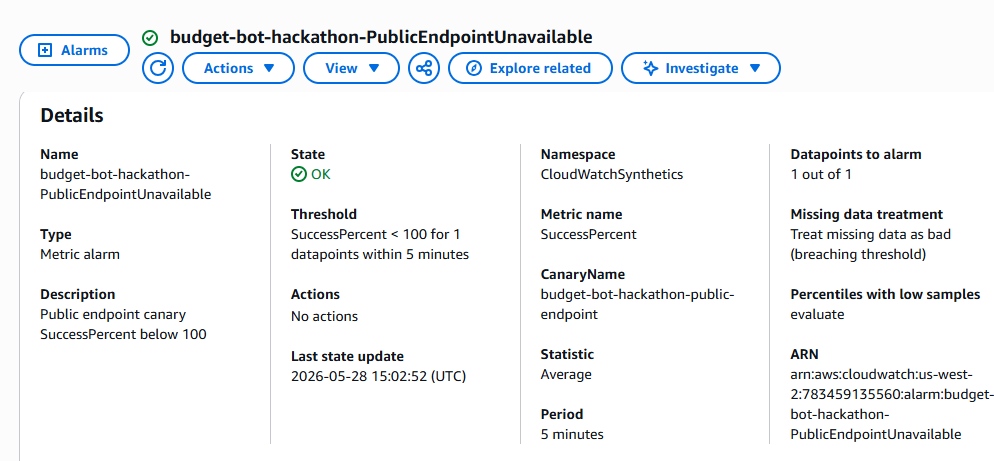
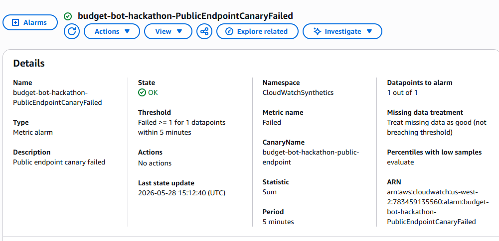
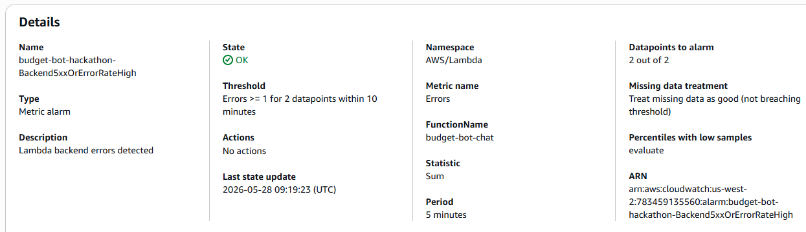
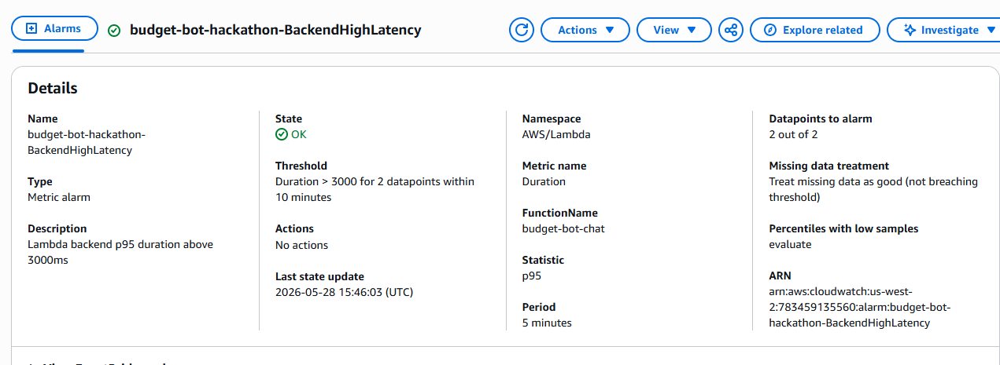
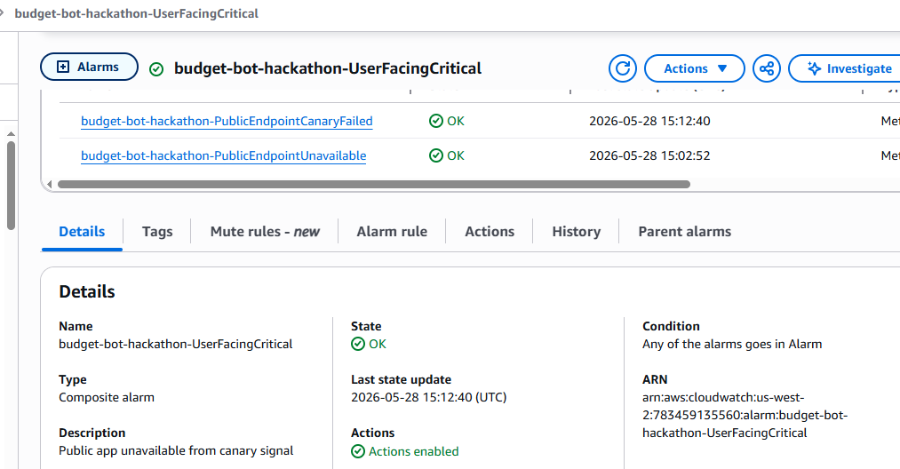
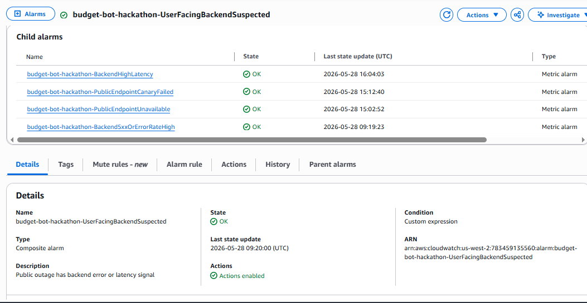

#### Scope 02: Backend Compute Failure
Problem:
- Detect when backend Lambda compute has execution errors, throttles, or near-timeout duration.
- User impact: slow requests, 5xx responses, failed upload/chat workflows.
- System impact: affects Core 2 Application Compute for `budget-bot-chat` and `budget-bot-upload`.

Objective:
- Use native `AWS/Lambda` metrics: `Errors`, `Throttles`, and `Duration`.
- Monitor `budget-bot-chat` and `budget-bot-upload` for execution errors and throttles.
- Monitor `budget-bot-chat` duration against its 10-second timeout.
- Page only through `BackendComputeCritical` when compute signal is combined with `UserFacingCritical`.

Alarms:

| Alarm | Source | Condition | Action |
| --- | --- | --- | --- |
| `ComputeExecutionErrorsHigh` | `AWS/Lambda Errors`, metric math `chat + upload` | `>= 1`, 2 periods | Child alarm |
| `ComputeThrottleOrConcurrencyLimit` | `AWS/Lambda Throttles`, metric math `chat + upload` | `>= 1`, 1 period | Child alarm |
| `ComputeDurationNearTimeout` | `AWS/Lambda Duration`, `budget-bot-chat` | `p95 > 8000ms`, 2 periods | Child alarm |
| `BackendComputeCritical` | Composite | Compute error/throttle/duration alarm AND `UserFacingCritical` | SNS alert |

Evidence images:
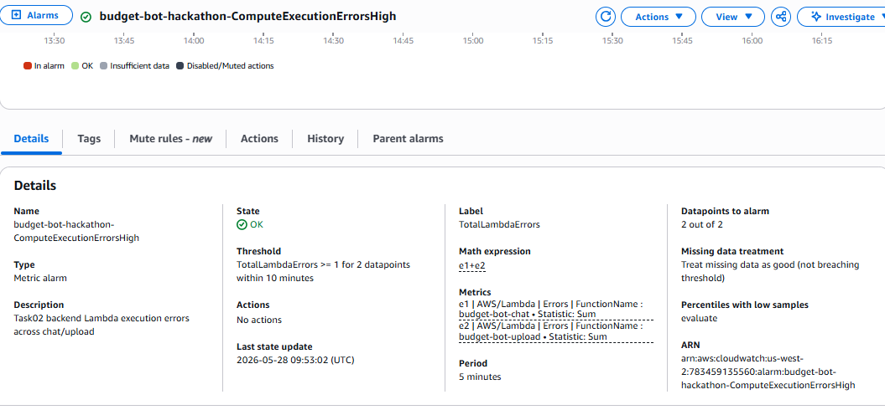
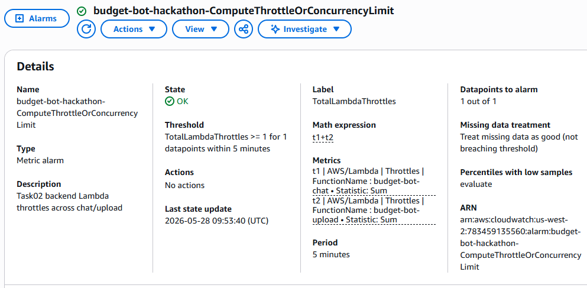
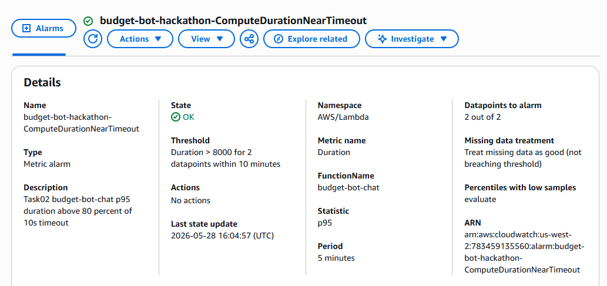
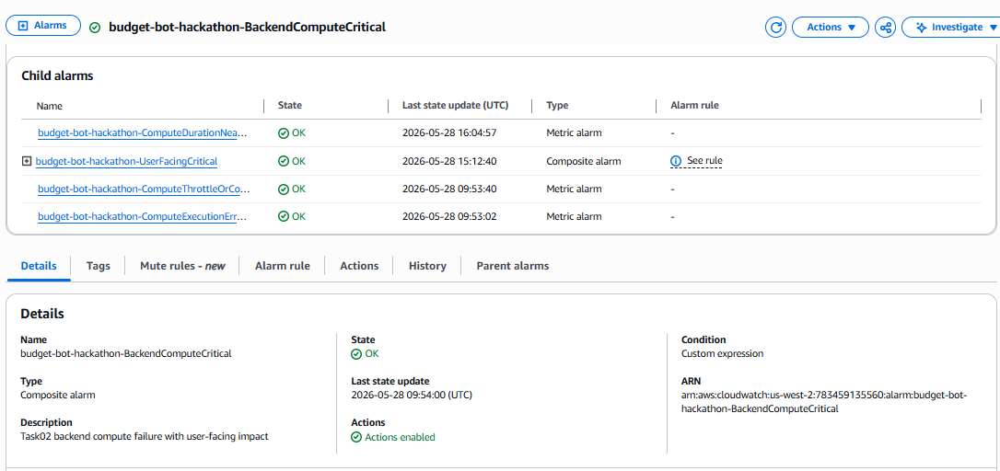

#### Scope 03: AI Feature End-to-End Failure
Problem:
- Detect when the Bedrock-backed AI feature fails, becomes slow, reaches quota pressure, or falls back.
- User impact: lower-quality fallback, delayed AI response, or failed AI workflow.
- System impact: affects Core 3 AI/ML Feature and can cascade into backend/user-facing incidents.

Objective:
- Monitor Bedrock with native `AWS/Bedrock` metrics: invocation error rate, invocation latency, and estimated TPM quota usage.
- Monitor AI fallback from `/aws/lambda/budget-bot-chat` with CloudWatch Logs metric filter `budget-bot-hackathon-ai-fallback-filter`.
- Page only through `AiFeatureCritical` when AI failure/quota pressure is combined with `UserFacingCritical` or `BackendComputeCritical`.

Alarms:

| Alarm | Source | Condition | Action |
| --- | --- | --- | --- |
| `AiInvocationErrorRateHigh` | `AWS/Bedrock InvocationClientErrors / Invocations` metric math | `> 5%`, 2 periods | Child alarm |
| `AiLatencyHigh` | `AWS/Bedrock InvocationLatency` | `p95 > 8000ms`, 2 periods | Degraded child alarm |
| `AiThrottleHigh` | `AWS/Bedrock EstimatedTPMQuotaUsage` | `Average > 80`, 2 periods | Critical/degraded child alarm |
| `AiFallbackRateHigh` | `FullObservability/Logs AiFallbackCount` | `Sum >= 1`, 2 periods | Degraded child alarm |
| `AiFeatureCritical` | Composite | AI error/throttle AND user-facing/backend compute impact | SNS alert |
| `AiFeatureDegraded` | Composite | AI latency OR fallback OR throttle | No direct action |

Evidence images:
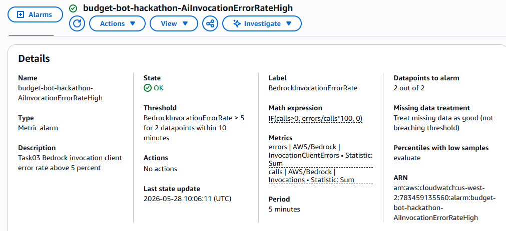
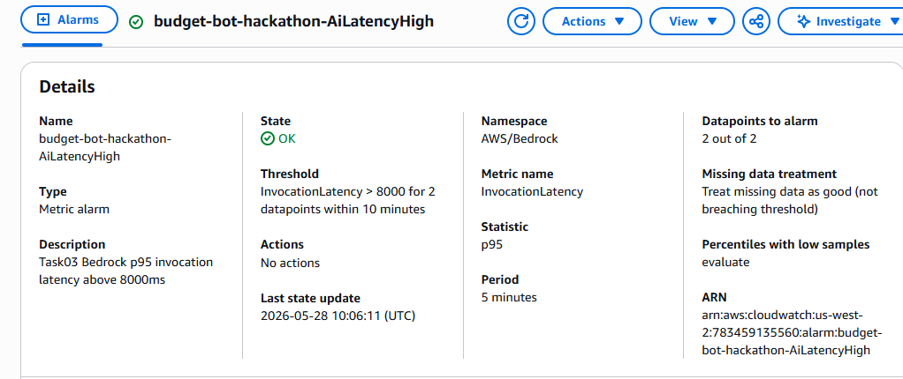
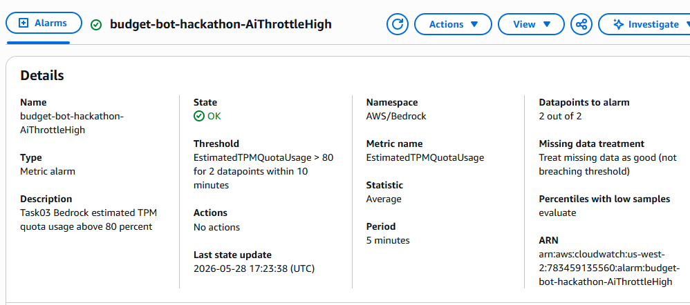
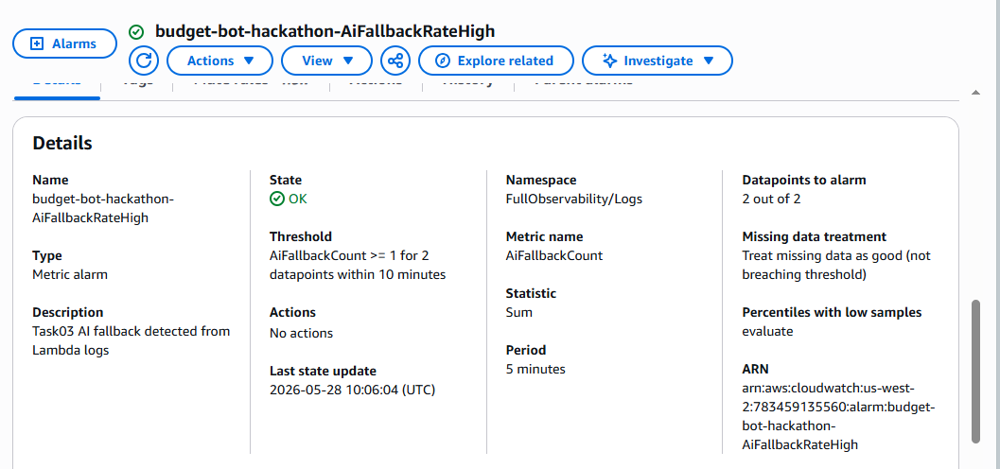
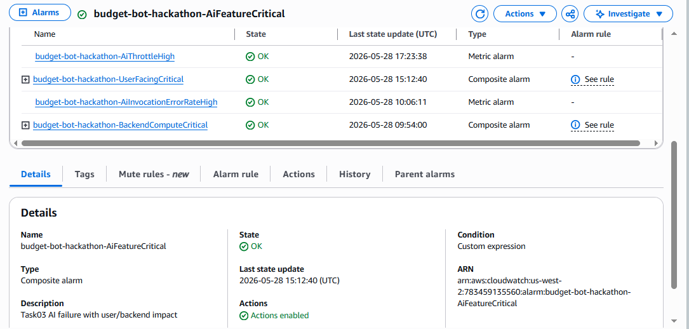
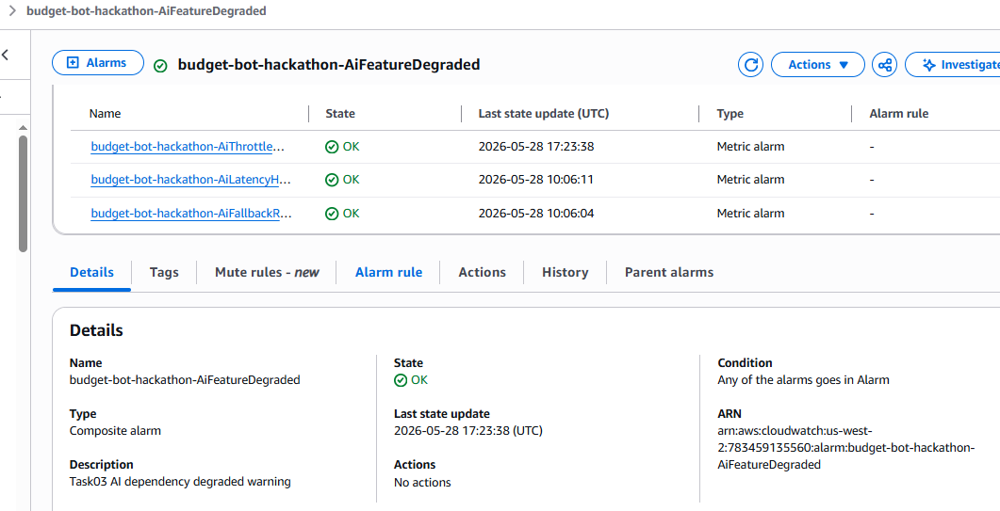

### 8.2 Log Insights Query

#### Case 1: Public HTTPS App Unavailable (Recent Backend Errors)
**Mục đích:** 
Điều tra hệ thống khi nhận được cảnh báo `UserFacingCritical` (ứng dụng web không truy cập được). Truy vấn này lọc toàn bộ API Gateway và Lambda Logs để tìm các request bị lỗi (HTTP 5xx, Timeout, Exception). Mục đích cốt lõi là xác định nhanh `request_id`, `route` bị ảnh hưởng và phân biệt lỗi này là do định tuyến mạng (Public Routing) hay do backend/dependency bị sập.

**Kết quả:** 
Truy vấn đã scan hàng trăm records trong vài giây và bắt được chính xác các request gây lỗi. Nhờ việc cài đặt `StructuredLoggingMiddleware` trong code, log được trả về dưới định dạng JSON rất sạch sẽ, hiển thị rõ `httpMethod`, `ip`, và đặc biệt là độ trễ `latency` cùng với `request_id`.

**Đề xuất tiếp theo:** 
Sử dụng `request_id` thu được từ bảng kết quả để trace (truy vết) xem request này đang gọi vào Route nào. Áp dụng Runbook điều tra để kiểm tra tài nguyên đích (Bedrock/DB) có đang bị quá tải hay sập không.

#### Case 2: Backend Compute Failure (Timeouts & Errors)
**Mục đích:**
Điều tra nguyên nhân gốc khi báo động `BackendComputeCritical` hoặc `ComputeDurationNearTimeout` kích hoạt. Truy vấn này quét qua log của các hàm Lambda (`budget-bot-chat` và `budget-bot-upload`) để lọc ra các log hệ thống dạng `REPORT`, `ERROR` hoặc các từ khóa "timeout", "exception", "throttle". Mục đích là xác định xem Lambda có bị sập do hết thời gian thực thi (timeout) hay cạn kiệt RAM (OutOfMemory) hay không.

**Kết quả:**
Bảng kết quả trả về hiển thị chính xác các log. Đáng chú ý nhất là hệ thống bắt được các bản ghi `REPORT` của Lambda `budget-bot-upload` với chỉ số `Duration: 30000.00 ms`. Điều này chứng minh Lambda đã chạm ngưỡng timeout cứng 30 giây (Max Timeout) và bị AWS ép buộc dừng (Force Kill), giải thích lý do vì sao request bị sập.

**Đề xuất tiếp theo:**
Kiểm tra chi tiết `request_id` của các tác vụ bị timeout 30 giây này. Nếu nguyên nhân do xử lý file CSV quá lớn hoặc gọi AI quá lâu, giải pháp là cấu hình tăng giới hạn Timeout của Lambda (lên 60s hoặc 90s) hoặc chuyển kiến trúc sang xử lý bất đồng bộ (như đẩy vào SQS).


#### Case 3: AI Feature End-to-End Failure (AI Metrics & Errors)
**Mục đích:**
Giám sát toàn diện trạng thái sức khỏe của tính năng gọi AI (Amazon Bedrock). Khác với các truy vấn tìm kiếm log đơn thuần, truy vấn này sử dụng hàm tổng hợp có điều kiện (`sum(if(...))`) để phân nhóm các lỗi AI thành 4 hạng mục cụ thể trong mỗi chu kỳ 5 phút (`bin(5m)`): Lỗi Fallback, Lỗi Quota/Throttle, Lỗi Timeout/Latency, và Lỗi Bedrock (Validation/AccessDenied).

**Kết quả:**
Bảng kết quả trả về hiển thị số lượng lỗi được gom nhóm rất trực quan. Theo như ảnh chụp, hệ thống không ghi nhận lỗi Fallback hay Quota, nhưng bắt được các sự kiện thuộc nhóm `latency_timeout_events` rải rác ở các khung giờ khác nhau. Điều này cho thấy model AI đang hoạt động bình thường về mặt logic và phân quyền, nhưng thỉnh thoảng gặp độ trễ cao khi xử lý suy luận.

**Đề xuất tiếp theo:**
Nhờ việc phân nhóm lỗi rõ ràng, quá trình gỡ lỗi (troubleshoot) trở nên cực kỳ nhanh chóng:
- Nếu cột `quota_or_throttle_events` tăng cao: Cần cấu hình Exponential Backoff hoặc xin AWS tăng TPM/RPM quota.
- Nếu cột `latency_timeout_events` (như trong hình) tăng cao: Cần cân nhắc chuyển sang model nhỏ hơn (như Haiku/Nova Lite) để phản hồi nhanh hơn, hoặc nới lỏng mức Timeout của API Gateway.

## 6.5 Measurement & Decisions

### DECISION 1: Chọn Amazon Nova Lite cho phân loại giao dịch (Upload Lambda)
**ALTERNATIVES CONSIDERED:**
- **Claude 3.5 Sonnet** — eliminated because: $3/1M input tokens, quá đắt cho bài toán phân loại text ngắn (1 dòng giao dịch). Xử lý file CSV 1000 dòng sẽ tốn ~$0.15/file.
- **Claude 3.5 Haiku** — eliminated because: $0.25/1M input tokens, rẻ hơn Sonnet nhưng vẫn đắt gấp 4 lần Nova Lite.

**MEASUREMENT:**
- **Cost per feature (Nova Lite)** = $0.06/1M input tokens — [Theo bảng giá AWS Bedrock]. File CSV 50 dòng ≈ 5000 tokens ≈ $0.0003.
- **Latency** = ~400-800ms/request — [Đo qua CloudWatch Lambda Duration metric].
- **Accuracy** = Phân loại đúng 45/50 dòng giao dịch mẫu (90%) — [Đo bằng file `sample_statement.csv`].

**EVIDENCE:**
> *[Chèn screenshot CloudWatch metrics hoặc ảnh bảng giá AWS Bedrock]*

**TRADE-OFF ACCEPTED:**
- Hy sinh khả năng suy luận ngữ cảnh sâu (reasoning) của Claude Sonnet. Nova Lite có thể phân loại sai các giao dịch mơ hồ (ví dụ: "CK QR 12345" → "Other"). Bù đắp bằng Rule Engine chạy trước AI để xử lý các giao dịch dễ đoán + Human-in-the-loop cho các giao dịch low confidence.

---

### DECISION 2: RDS PostgreSQL Single-AZ thay vì DynamoDB hoặc Multi-AZ
**ALTERNATIVES CONSIDERED:**
- **DynamoDB** — eliminated because: Bài toán FinTech cần `SELECT category, SUM(amount) FROM transactions WHERE month='2026-05' GROUP BY category`. DynamoDB không hỗ trợ SQL aggregate → phải Scan toàn bộ bảng rồi tính toán ở Lambda → lãng phí RCU, code phức tạp hơn.
- **RDS Multi-AZ** — eliminated because: Chi phí nhân đôi ($0.036/h thay vì $0.018/h). High Availability không cần thiết cho dự án hackathon 48 giờ.

**MEASUREMENT:**
- **Cost per hour (db.t3.micro Single-AZ)** = $0.018/h ≈ $0.86/48h hackathon — [AWS Pricing Calculator].
- **Query complexity** = 1 câu SQL vs ~30 dòng code DynamoDB Scan + filter + aggregate — [So sánh thực tế khi code].

**EVIDENCE:**
> *[Chèn screenshot Terraform code `multi_az = false` hoặc RDS Console]*

**TRADE-OFF ACCEPTED:**
- Hy sinh khả năng auto-scaling vô hạn của DynamoDB và failover tự động của Multi-AZ. Nếu instance RDS gặp sự cố, dữ liệu demo sẽ mất. Chấp nhận rủi ro này vì hackathon chỉ kéo dài 48h và dữ liệu có thể tái tạo bằng cách upload lại CSV.

---

### DECISION 3: Không dùng NAT Gateway — dùng VPC Endpoints thay thế
**ALTERNATIVES CONSIDERED:**
- **NAT Gateway** — eliminated because: Chi phí cố định ~$1.08/ngày ($32/tháng) chỉ để cho Lambda trong Private Subnet truy cập Internet. Quá đắt cho hackathon.
- **Public Subnet cho Lambda** — eliminated because: Vi phạm nguyên tắc Network Isolation (Capability #6). DB sẽ bị expose gián tiếp.

**MEASUREMENT:**
- **Cost saving** = $32/tháng (NAT Gateway) vs $7.25/tháng (1 Interface Endpoint) = tiết kiệm $24.75/tháng (~77%) — [AWS Pricing].
- **S3 Gateway Endpoint** = $0/tháng (miễn phí hoàn toàn).

**EVIDENCE:**
> *[Chèn screenshot Terraform `vpc_endpoints` config hoặc VPC Console]*

**TRADE-OFF ACCEPTED:**
- Lambda không thể truy cập bất kỳ service nào ngoài S3 và Bedrock (không có Internet outbound). Nếu cần thêm service (ví dụ: gọi API bên thứ 3), phải tạo thêm Interface Endpoint hoặc chuyển sang NAT Gateway.

## 9. Bonus Paths Claimed

### Bonus B: CI/CD Pipeline (GitHub Actions)
- Mỗi khi push code lên `main`, GitHub Actions tự động:
  - Build Frontend (Next.js) → Upload artifact lên S3.
  - Package Backend (Python + dependencies) → Deploy lên Lambda.
  - Chạy `terraform plan` + `terraform apply` tự động cho hạ tầng.
- **Evidence:** [Chèn link GitHub Actions workflow hoặc screenshot pipeline xanh]

### Bonus C: Custom Domain + HTTPS (Route 53 + ACM)
- **Custom Domain:** [Điền domain — ví dụ: `budgetbot.yourdomain.com`] trỏ về CloudFront Distribution.
- **ACM Certificate:** Chứng chỉ SSL/TLS được cấp tự động qua AWS Certificate Manager (DNS validation qua Route 53). Terraform module `acm` tự tạo bản ghi CNAME xác thực.
- **CloudFront:** Cấu hình `aliases` trỏ về custom domain, `viewer_certificate` sử dụng ACM cert với `ssl_support_method = "sni-only"` và `minimum_protocol_version = "TLSv1.2_2021"`.
- **HTTPS Enforcement:** `viewer_protocol_policy = "redirect-to-https"` — tất cả HTTP request tự động chuyển hướng sang HTTPS.
- **Evidence:** [Chèn screenshot Route 53 hosted zone + ACM certificate status "Issued"]

### Bonus E: Infrastructure as Code (Terraform)
- Toàn bộ hạ tầng (VPC, Lambda, API Gateway, RDS, S3, CloudFront, Cognito, ACM, Route 53) được quản lý 100% bằng Terraform.
- Có thể teardown và redeploy toàn bộ hệ thống trong < 5 phút bằng `terraform destroy` + `terraform apply`.
- **Evidence:** Repo `Terraform_Hackathon/` chứa toàn bộ modules tái sử dụng.

## 10. Lessons Learned (~200 words)
- **Bảo mật vs Chi phí:** Thiết kế VPC không có NAT Gateway buộc chúng tôi phải hiểu rõ cơ chế VPC Endpoints. Kết quả: tiết kiệm $32/tháng mà vẫn đảm bảo dữ liệu tài chính không bao giờ đi qua Internet công cộng. Bài học: "Secure by Design" không nhất thiết phải đắt.
- **Hybrid AI Funnel:** Phụ thuộc 100% vào LLM cho mọi dòng giao dịch vừa tốn tiền vừa chậm. Tích hợp Rule Engine deterministic chạy trước AI giúp tối ưu cả chi phí lẫn tốc độ phản hồi — chỉ dùng "trí thông minh đắt tiền" cho những trường hợp thực sự mơ hồ.
- **Ship, Don't Polish:** Trong hackathon 48h, chúng tôi đã mắc sai lầm ban đầu khi dành quá nhiều thời gian cho UI styling. Bài học rút ra: Backend chạy được + AI respond được = 80% điểm số. UI đẹp = 0% điểm số.
- **Đo lường trước khi quyết định:** Việc so sánh giá Nova Lite vs Haiku vs Sonnet bằng con số cụ thể ($0.06 vs $0.25 vs $3/1M tokens) giúp team ra quyết định tự tin trong 5 phút thay vì tranh cãi chủ quan.
